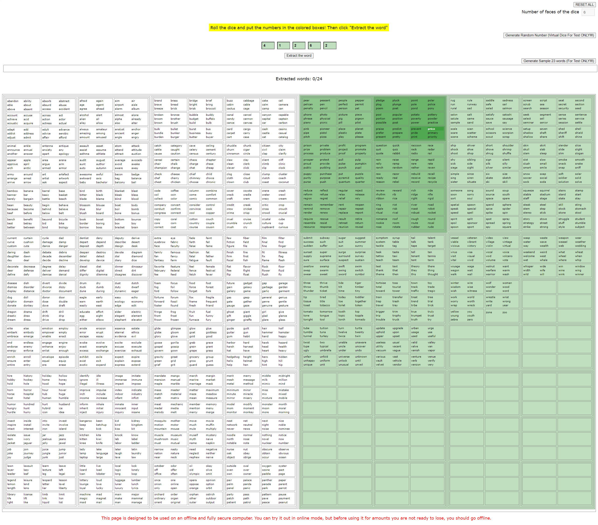

#   Don't use its bugged, the words not have the same probabilities!
#   Don't use its bugged, the words not have the same probabilities!
#   Don't use its bugged, the words not have the same probabilities!

# Bitcoin Seed Phrase Composer With Dice
Offline bitcoin seed phrase composer tool with visual word selection verification.

Available here to test it https://n3s1us.github.io/bitcoin-seed-phrase-composer-with-dice/

  

# Create your own wallet seed using regular dice
If you want maximum security you should of course not rely on a 3rd party to generate your wallet seed. This is a way to do it using only regular 6-sided dice.

To be really, really sure that you have created a Bitcoin wallet that's secure you should generate the wallet seed offline and using a method that is transparent, i.e. where you can audit the process yourself and understand where the entropy/randomness comes from.

he good thing about this method is that it is completely obvious what you are doing. You want 23 random words from a list of 2048 words so you simply draw words from a hat.

# WHAT ABOUT THE 24TH WORD?!
The 24th word in a BIP-39 seed is not a randomly generated one. Actually, the way a seed is normally generated is by a computer generating 256 bits of random data. From this data a checksum of 8 bits is then calculated and appended to the 256 bits. The 264 resulting bits are divided into 24 parts of 11 bits each and each one of those 11 bits is converted into a word, using a predetermined word list.

This means that part of our 24th word is actually a checksum so we can’t just choose any word, it has to be calculated. As this is almost impossible to do manually (it involves using the SHA-256 hash function) this tool has a “last word calculator”.

# HOW TO USE?
This tool is simply a single file web page using javascript for calculations, that can be downloaded and used offline. Now, since you have been really focused on maximum security so far you should keep that mindset for this step too.

I recommends booting any Linux Live from a USB stick, get the web page on the same or another USB stick and then NEVER connect this Linux Live to internet neither before nor after!

---
I copied some text from [here](https://en.bitcoin.se/articles/create-your-own-wallet-seed-using-regular-dice) and some code from [here](https://seedpicker.net/calculator/last-word.html) sorry I'm lazy :)

In any case, donations are welcome

bc1qzxvd55p0vxks6ffrrja65e4rcsd3ndhf8gme72
